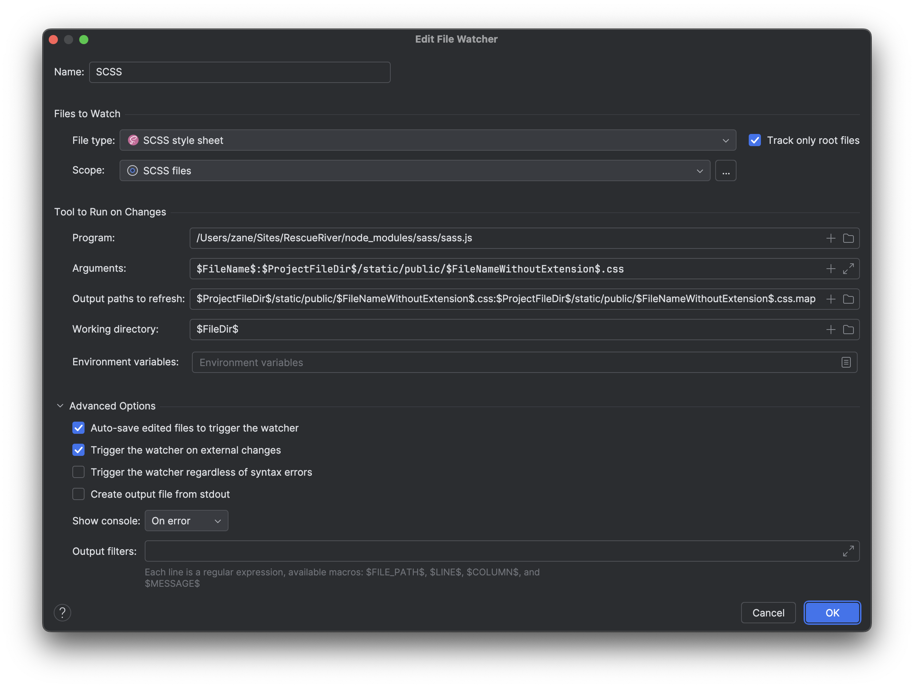

## ⚙️ WebStorm Setup

### 🐞 Debugging

#### 1. Add a Debug Configuration

1. Open **Run/Debug Configurations** in WebStorm
2. Click **+ (Add New Configuration)**
3. Select **Attach to Node.js/Chrome**
4. Set the **Name** to `localhost`
5. Set the **Port** to `9229`
6. Click **Apply** and **OK**

#### 2. Start the Server

- 🐳 **Docker**: `docker-compose up`
- 🏠 **Local**: `just start`

#### 3. Attach the Debugger

- Click the `🐞 (Debug)` button to run in debug mode

### Auto-Compile SCSS

1. Go to **Settings → Tools → File Watchers**  

2. Click the **+** icon and select **Sass/SCSS**.

3. Configure the watcher:  
   

4. Save the watcher. Now, editing and saving `.scss` files will automatically compile them to `.css`.

### 🧰 Recommended Extensions

- GitHub by JetBrains
- Just by linux_china
- Light Sheet by Victoryil
  > WebStorm bundles some plugins like Docker automatically

[//]: # "TODO: UPDATE VS Code Setup"

## ⚙️ Visual Studio Code Setup

### 🐞 Debugging

- On MacOS press `cmd + shift + p` to open the command palette
- Search `Debug: Toggle Auto Attach` and set it to `Only With Flag`

### 🧰 Recommended Extensions

- Container Tools by Microsoft
- Docker by Microsoft
- Docker DX by Docker
- Excel Viewer by MESCIUS
- GitHub Copilot by GitHub
- Github Copilot Chat by Github
- Prettier - Code formatter by Prettier
